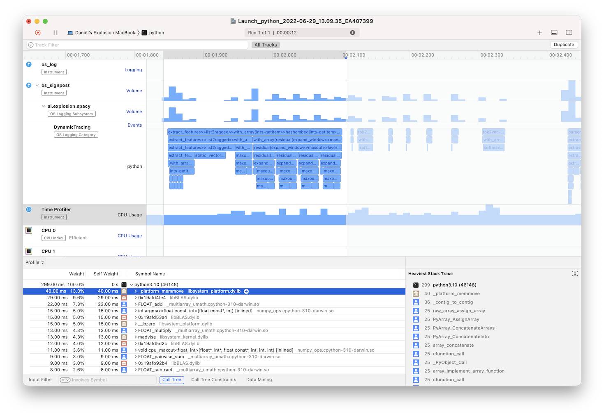

# os-signpost

macOS provides the
[`OSSignposter`](https://developer.apple.com/documentation/os/ossignposter) API
for measuring the duration of tasks in a program or marking events. These
so-called signposts can be visualized in the
[Instruments.app](<https://en.wikipedia.org/wiki/Instruments_(software)>) application.
This Python package provides a wrapper for the `OSSignposter` API, so that you
can mark tasks and events in Python applications.



## ⏳ Install

Make sure you have [Xcode](https://developer.apple.com/xcode/) installed and
then install with `pip`:

```bash
pip install os-signpost
```

## 🚀 Quickstart

### Creating a `Signposter`

`Signposter` is the main class of this package. You should create an instance of
`Signposter` in order to emit an event. You can create an instance as follows:

```python
from os_signpost import Signposter
signposter = Signposter("com.example.my_subsystem", Signposter.Category.DynamicTracing)
```

The first argument to the constructor is the name of the subsystem, which is
usually the name of your organization followed by the name of the subsystem.
The second argument is the category within the subsystem. The system uses the
category to filter events. There are three predefined categories available:

- `Category.PointsOfInterest`: signposts with this category are always enabled.
  The _Points of Interest_ instrument shows signposts with this category.
- `Category.DynamicTracing`: signposts with this category are only enabled when
  recording with a performance tool like Instruments.app. Create an os_signpost
  instrument that filters for the subsystem name to visualize `DynamicTracing`
  signposts.
- `Category.DynamicStackTracing`: this category behaves like `DynamicTracing`,
  but also records backtraces.

### Make signposts for the duration of a tasks

To measure the duration of a task, you can create signposts that mark an
interval. The `Signposter.begin_interval` method adds a signpost that marks the
beginning of an interval and returns a callback. This callback then marks the
end of the interval:

```python
end_interval = signposter.begin_interval("begin my task")
# The task for which you want to measure the duration.
end_interval("end my task")
```

Both the `begin_interval` method and the callback take a message.
Instruments.app includes these messages in the visualization and allows you to
categorize intervals by their messages. When no message is specified for the
interval end, the same message as the begin will be used.

You can also use the `Signposter.use_interval` context manager in place of the
callback approach:

```python
with signposter.use_interval("begin my task", "end my task"):
    # The task for which you want to measure the duration.
```

`use_interval` takes the begin and end messages as its arguments. The end
message is also optional for the context manager.

### Emitting an event

Besides marking intervals, you can also emit an event signpost. Instruments.app
shows events as single points. The `Signposter.emit_event` method emits an
event:

```python
signposter.emit_event("lp0 on fire")
```

## 🙈 Limitations

The macOS signpost API also allows associating a name with a signpost. However,
this name is required to be a C string literal. Therefore, we hardcode the name
of signposts `python`.
